# ChatBridgeReforged

- Beta version, please bear the risk if you use it
- v0.0.1-Beta
- only tested for python 3.7 and 3.8
- python version should be 3.7+
- `pip install -r requirements.txt` to install requirements!

  

## Compare to [ChatBridge](https://github.com/TISUnion/ChatBridge)

- use [trio](https://trio.readthedocs.io/) for Asynchronous processing
- more feature will be release in the future
- support to [ChatBridge](https://github.com/TISUnion/ChatBridge) `version` < `2.0` clients so far
  - Some function in ChatBridge will not be supported
- [Ricky](https://github.com/R1ckyH) is a suck author
  - But he will try his best to maintain this repository
  - Please cheer him so that he will be happy to maintain this repository

## Basic

use `##help` to get plugin help command
use `##CBR` to get help command

#### CBR Server setup
Pls put in file structure like
```
-cbr
-ChatBridgeReforged_Server.py
```
Start server with run `ChatBridgeReforged_Server.py`

put `ChatBridgeReforged_MC.py` in MCDR's plugins file

Setup `config.yml` in previous file and

`config/ChatBridgeReforged_MC.json` in MCDR


## Config

`edit config.yml for config`

### server_setting
`Dict`

| config    | data type | description              |
|-----------|-----------|--------------------------|
| host_name | `string`  | ip address for hosting   |
| port      | `int`     | port for hosting         |
| aes_key   | `string`  | key for `AES` encryption |

### clients
`list`

| config   | data type | description        |
|----------|-----------|--------------------|
| name     | `string`  | name of client     |
| password | `string`  | password of client |
| config   | data type | description        |

### log
`Dict`

| config           | data type | description                           |
|------------------|-----------|---------------------------------------|
| size_to_zip      | `double`  | size to zip the file `latest.log`(kb) |
| split_log        | `bool`    | split log to chat log and normal log  |
| size_to_zip_chat | `bool`    | size to zip the file `chat.log`(kb)   |

### debug
`Dict`

| config | data type | description       |
|--------|-----------|-------------------|
| all    | `bool`    | debug mode switch |
| CBR    | `bool`    | debug mode switch |
| plugin | `bool`    | debug mode switch |

## cqhttp

[cqhttp document](https://github.com/R1ckyH/ChatBridgeReforged/tree/master/doc/cqhttp.md)

## Plugin

[Plugin document](https://github.com/R1ckyH/ChatBridgeReforged/tree/master/doc/plugin.md)

Plugin Catalogue will launch after release
