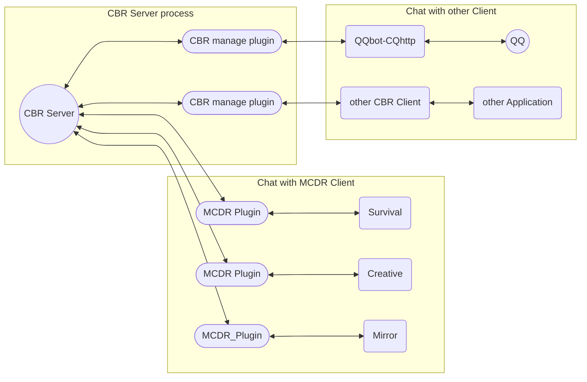

```mermaid
flowchart LR
  subgraph CBR Server process
    Server((CBR Server))
    Server<---->plugin1([CBR manage plugin])
    Server<---->plugin2([CBR manage plugin])
  end
  subgraph Chat with MCDR Client
    mcdr_plugin1<-->survival(Survival)
    mcdr_plugin2<-->creative(Creative)
    mcdr_plugin3<-->mirror(Mirror)
  end
  subgraph Chat with other Client
    plugin1<-->other(other CBR Client)
    plugin2<-->qqbot(QQbot-CQhttp)<-->QQ((QQ))
    other<-->other_software(other Application)
  end
  Server<---->mcdr_plugin1([MCDR Plugin])
  Server<---->mcdr_plugin2([MCDR Plugin])
  Server<---->mcdr_plugin3([MCDR_Plugin])
```