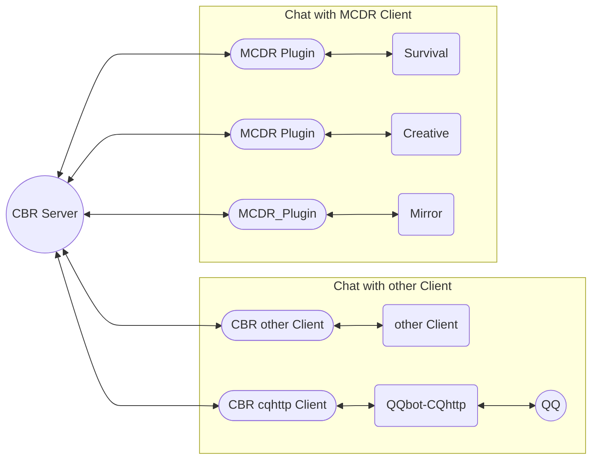

```mermaid
flowchart LR
  Server((CBR Server))
  Server<---->plugin1([MCDR Plugin])
  Server<---->plugin2([MCDR Plugin])
  Server<---->plugin3([MCDR_Plugin])
  Server<---->client1([CBR other Client])
  Server<---->client2([CBR cqhttp Client])
  subgraph Chat with other Client
    client1<-->other(other Client)
    client2<-->qqbot(QQbot-CQhttp)<-->QQ((QQ))
  end
  subgraph Chat with MCDR Client
    plugin1<-->survival(Survival)
    plugin2<-->creative(Creative)
    plugin3<-->mirror(Mirror)
  end
```